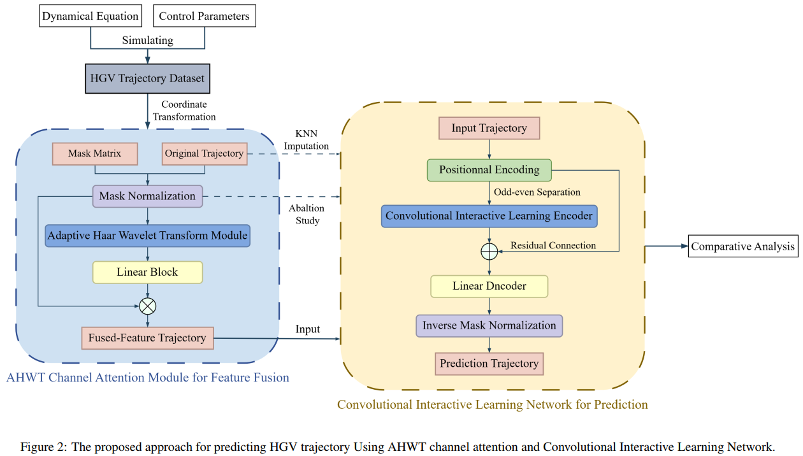
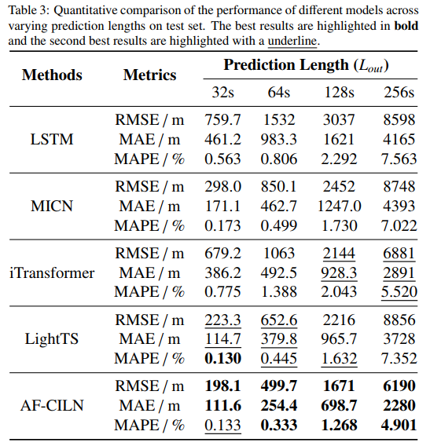
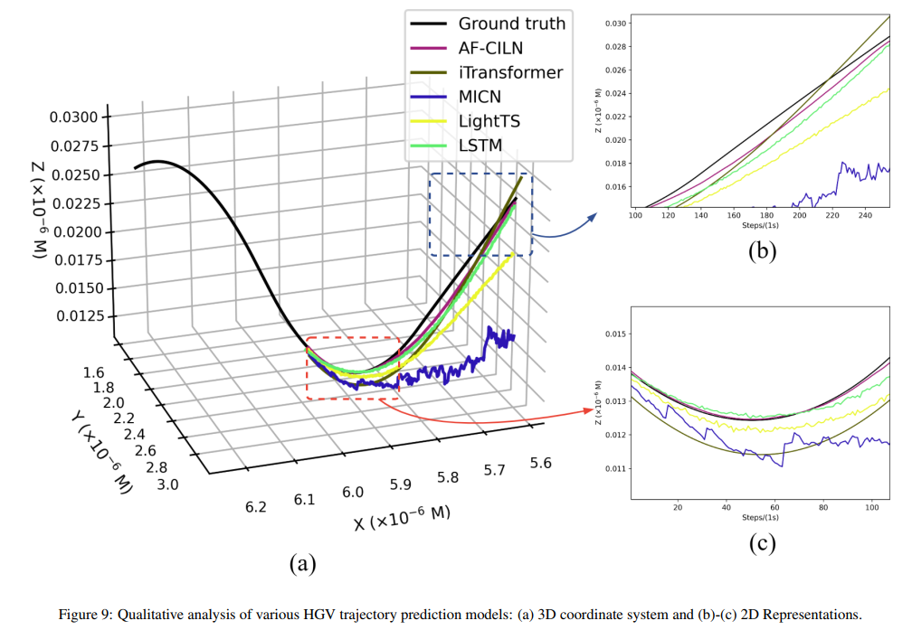

# AF-CILN

## Overview

Code release of paper "Convolutional interactive learning  network with auxiliary features for hypersonic glide vehicle trajectory prediction under data missing scenarios".

## Getting Started

### Environment Requirements

To get started, ensure you have Conda installed on your system and follow steps to set up the environment:

```
conda create -n AF_CILN python=3.12.7
conda activate AF_CILN
pip install -r requirements.txt
```

In addition, you need to install the visualization tool Clearml. For specific installation and usage methods, please refer to the following link: https://github.com/clearml/clearml

### Data Preparation

Due to the limited upload space on the platform, we provide a mini dataset under `./dataset` for quick start. This dataset contains a training set and a validation set and input length of this dataset is 256s. The mini dataset comprises 5% of the trajectories, and due to the limited data volume, the test performance of all models may deviate from that reported in the paper.

### Training Example

You can implement the training process by running the following sample script. All training results will be uploaded to your ClearML platform for visualization. The trained model will be saved under `./result`  folder.

```
python train.py --model_name "AF-CILN"--missing_radio 0.1
```

### The Proposed Method



### Main Results





## Acknowledgement

We extend our heartfelt appreciation to the following repositories for providing valuable code bases:

https://github.com/pytorch/pytorch

https://github.com/ts-kim/RevIN

https://github.com/thuml/Time-Series-Library

https://github.com/wanghq21/MICN

https://github.com/thuml/iTransformer

https://tinyurl.com/5993cmus

https://github.com/cure-lab/SCINet


